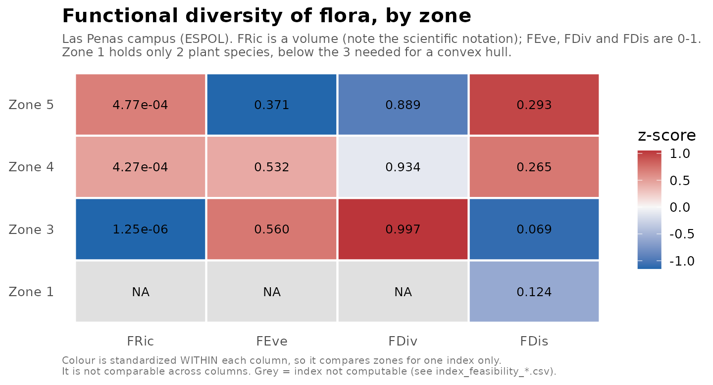
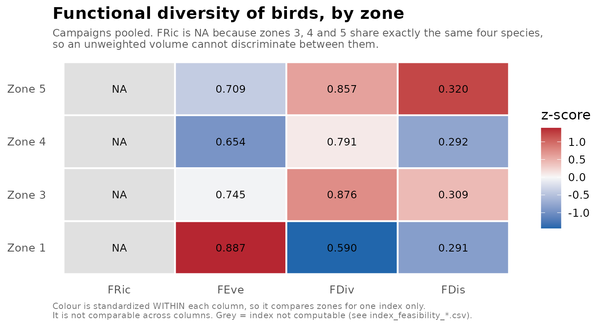
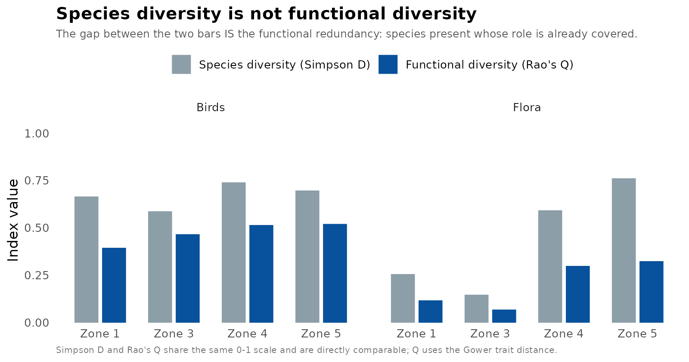
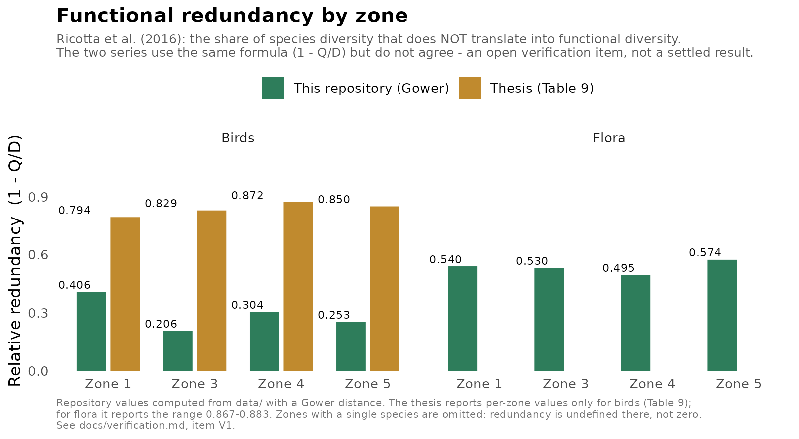

# Functional diversity of the Las Peñas campus (ESPOL)

[](LICENSE)
[](LICENSE)
[](https://www.r-project.org/)
[](#)

R pipeline and field dataset characterizing the **functional diversity** of the
flora and fauna of the Las Peñas campus (ESPOL, Guayaquil, Ecuador) as a
**pre-intervention reference condition** for the campus remodeling.

Capstone project (*Proyecto Integrador*), Biology · Miguel Ángel Morán
Piedrahita · ESPOL, 2026. Supervisor: Julián Alfredo Pérez Correa, PhD.

> 🇪🇸 **[Resumen en español](#resumen-en-español)** at the bottom, and a full
> Spanish version in **[LEEME.md](LEEME.md)**.

---

## Why this exists

More than half of a 3.25 ha campus — sitting among the last dry-forest fragments
inside Guayaquil, a few metres from the Guayas river — is being rebuilt, and no
one had recorded what lived there. Ecuador's seasonally dry forest shrank by
2 632 km² between 1990 and 2018; only 13 % of the coastal remnant has any
protective status, and roughly 80 % of its biota is endemic to the Tumbesian
region.

Counting species does not answer the question a construction project raises.
Richness says nothing about what those species **do**, and it is the doing that
gets disrupted. This repository measures the traits instead.

## What it does

Computes, per zone and per taxonomic group:

| Index | What it captures |
|---|---|
| **FRic** | Functional richness — volume of trait space occupied |
| **FEve** | Functional evenness — regularity of abundance across that volume |
| **FDiv** | Functional divergence — how far the abundant species sit from the centre |
| **FDis** | Functional dispersion — abundance-weighted mean distance to the centroid |
| **Rao's Q** | Quadratic entropy — abundance-weighted mean pairwise trait distance |
| **FR** | Functional redundancy — the share of species diversity that is *not* functional diversity |
| **SES** | The above, standardized against a null model, so richness is controlled |

## Results





Two patterns dominate, and they belong together: **functional richness is low
everywhere** — the compression urban filters reliably produce, amplified by a
flora that is 100 % introduced ornamentals — while **functional divergence is
high** (0.59–1.00), meaning the abundant species sit at the periphery of that
small volume.

One result deserves to be read carefully. Bird FRic is `NA` for Zones 3, 4 and 5
because they contain *exactly the same four species*, and an unweighted volume
cannot distinguish identical species lists. Zone 1 is the exception — the only
zone with *Columba livia* and *Quiscalus mexicanus*. That the **car park** would
therefore post the campus's highest bird functional richness is the clearest
available argument against using any single index as a conservation criterion.



The gap between the two bars is functional redundancy: species whose ecological
role is already covered by another species present. It is the measurement behind
the resilience argument — a low FRic says the community occupies little trait
space, but it does **not** say different species do the same job. That is a
separate claim and it needs its own number.



⚠️ **The two redundancy series disagree.** This is an open, documented
verification item ([`docs/verification.md`](docs/verification.md), item **V1**),
not a settled result. Both use `FR = 1 − Q/D`; the gap is systematic and most
likely comes down to how the dissimilarity inside `Q` was scaled. Do not quote a
redundancy figure from this repository without reading that entry first.

## Quick start

```bash
git clone https://github.com/zacamias/FD_functional_diversity_indices.git
cd FD_functional_diversity_indices

# Figures and the redundancy / taxonomic analysis (needs only ggplot2, reshape2,
# cluster, vegan — no FD, so this runs almost anywhere)
Rscript R/figures_reference.R

# Full pipeline: all indices, null models, sensitivity analysis (needs FD)
Rscript R/functional_diversity_analysis.R
```

Run both **from the repository root**, not from `R/`. Outputs go to `results/`,
which is git-ignored and regenerated on every run.

To restore the exact package versions:

```r
install.packages("renv")
renv::restore()
```

> `renv.lock` was authored by hand from the versions reported in the thesis
> (§2.9). Run `renv::snapshot()` on your own machine to replace it with a
> hash-verified lockfile — that is the version worth trusting.

## Repository layout

```
├── R/
│   ├── functional_diversity_analysis.R   main pipeline
│   ├── redundancy.R                      Ricotta et al. (2016)
│   ├── null_models.R                     999-permutation SES
│   ├── taxonomic_diversity.R             Shannon, Simpson, Pielou, rarefaction
│   └── figures_reference.R               README figures (no FD needed)
├── data/
│   ├── README.md                         ← full data dictionary, units, caveats
│   ├── traits_flora.csv                  42 species × 7 traits
│   ├── abundance_flora.csv               crown cover by zone
│   ├── traits_fauna_survey{1,2,3}.csv
│   ├── abundance_fauna_survey{1,2,3}.csv
│   ├── species_metadata.csv              origin, group, provenance notes
│   ├── zones.csv                         areas and sampling effort
│   └── reference_results_thesis.csv      published Tables 8–9, for regression checks
├── docs/
│   ├── analysis.Rmd                      narrative notebook
│   └── verification.md                   ← every code/thesis discrepancy found
├── figures/
├── Tablas_muestreos.ods                  raw field record (9 sheets)
├── renv.lock
└── CITATION.cff
```

## Method

| Decision | Choice |
|---|---|
| Flora abundance | Crown-projection cover, fraction 0–1 |
| Fauna abundance | Detection counts per zone and campaign |
| Distance | Gower (mixed traits, internal range rescaling) |
| Transformation | `log10` on skewed continuous traits: mass, height, SLA |
| Ordination | PCoA, **Cailliez** correction for negative eigenvalues |
| Engine | `FD::dbFD`, with `mFD` as an optional cross-check |
| Redundancy | Ricotta et al. (2016), `FR = D − Q`, reported as `1 − Q/D` |
| Null model | 999 trait-label permutations → SES + exact two-tailed *p* |
| Sensitivity | Indices recomputed under raw, `log(x+1)` and presence/absence weighting |

**On the correction.** Gower distances on mixed traits are generally not
Euclidean, which produces negative PCoA eigenvalues and leaves the convex hull
behind FRic ill-defined. Lingoes adds a smaller constant and distorts less, so
it is arguably the better choice on the merits. **Cailliez is nevertheless the
default here**, because it is what produced the published tables, and a
repository whose job is to reproduce them must default to what produced them.
Switching is a one-line change and belongs in a reported sensitivity check, not
in a silent edit.

## Why birds are analysed separately

*Apis mellifera* accounted for **90.1–95.7 %** of the Zone 4 fauna records.
Because FDis weights distances by relative abundance, pooling it with the
vertebrates drags the community centroid onto one functional type and depresses
the index — an artefact, not an ecological finding. Analysed separately, the
effect disappears.

Two further reasons make the separation obligatory rather than convenient. The
honeybee counts are **extrapolated**, not observed: four 2.5 m units in *Ixora
coccinea* planters, scaled by a factor of 30.4 to the 304 m the plant occupies.
And those units sat in the four *longest* planters, not random ones — since
honeybees concentrate foragers on the richest patches through dance recruitment,
the number is an **upper bound**, an index of visitation intensity per unit of
floral resource rather than a population size.

## Controlling for richness

Every index here scales with richness by construction, and the zones span 2 to
26 plant species. Comparing zones directly therefore confounds *how many
species* with *how they are arranged in trait space* — "Zone 4 is functionally
richer" risks meaning no more than "Zone 4 has more species".

`R/null_models.R` shuffles the trait matrix's species labels 999 times while
holding the community matrix fixed:

- **SES < 0** — co-occurring species are more similar than an equally rich
  random draw: functional clustering, the expected urban-filtering signature.
- **SES > 0** — more different than expected: overdispersion.
- **SES ≈ 0** — the zone is a random subset, and the between-zone difference is
  a richness difference and nothing more.

The pool is the **campus** species list, so the test cannot ask whether the
campus itself is filtered relative to the regional dry-forest flora. That needs a
regional pool this study did not sample.

## Findings and management implications

**Conserve Zone 4 and its large-crowned trees** (*Tabebuia aurea*, *Gliricidia
sepium*, *Mangifera indica*, *Ficus benjamina*). The case does not rest on the
functional indices — for birds they do not discriminate between zones — but on
convergent evidence: highest plant richness (26 species), highest accumulated
crown cover (101.3 %), the only canopy stratum the frugivorous birds use, five
of the six native animal species, and the campus's only *Ixora coccinea*, the
sole floral resource on which pollinator activity was ever observed.

**Plant for the missing traits, not for the pretty species.** The trait matrix
names three concrete gaps: 86 % of species are evergreen and all six deciduous
species are introduced trees, so **no deciduous shrub exists on campus**; 26 %
are ornamental palms, all evergreen and zoochorous, the most redundant block in
the assemblage; and only 8 of 42 species sit at the conservative end of the
leaf-economics spectrum. Native dry-forest species that fill them:
*Handroanthus chrysanthus*, *Cordia lutea*, *Bonellia sprucei*,
*Pithecellobium excelsum*.

**Diversify the floral resource**, so the pollinator community is not one
introduced species visiting one introduced shrub.

**Re-run this pipeline after the works**, with the same methods and this study as
the reference.

## Limitations

- **Three campaigns, one seasonal window** (wet-to-dry transition). Full
  seasonal turnover is not captured.
- **Sampling effort varies 4.4-fold** between zones (2.9 to 12.9 points ha⁻¹;
  effective coverage 20.5 % to 90.9 %). Rarefaction helps for counts; it does not
  fully correct this.
- **No before–after design and no unintervened control.** Future change cannot be
  attributed unambiguously to the remodeling. The reference condition supports
  description, not causal inference.
- **Small n throughout** — four zones, 2–26 species each. Little room for
  inferential statistics; the null models are the right tool at this scale.
- **LDMC is systematically overestimated** (no rehydration before fresh-mass
  determination) and leaf subsamples came from one individual per species.
  Relative ordering along the leaf-economics axis holds — which is what Gower
  uses — but absolute values are not comparable to TRY or GLOPNET. Four further
  documented protocol deviations are in [`data/README.md`](data/README.md).
- **Zone 2, 57.3 % of the campus, was never assessed** — it was already under
  construction. The reference condition covers 42.7 % of the site.
- **Open verification items**, including the unresolved redundancy discrepancy:
  [`docs/verification.md`](docs/verification.md).

## Citation

See [`CITATION.cff`](CITATION.cff) — GitHub renders it as a "Cite this
repository" button.

## Licence

Code (`R/`, `docs/`): **MIT**. Data (`data/`, `Tablas_muestreos.ods`):
**CC BY 4.0**. See [`LICENSE`](LICENSE).

## Key references

- Villéger, S., Mason, N. W. H., & Mouillot, D. (2008). *Ecology*, 89(8), 2290–2301.
- Laliberté, E., & Legendre, P. (2010). *Ecology*, 91(1), 299–305.
- Ricotta, C., et al. (2016). *Methods in Ecology and Evolution*, 7(11), 1386–1395.
- Mouchet, M. A., et al. (2010). *Functional Ecology*, 24(4), 867–876.
- Maire, E., et al. (2015). *Global Ecology and Biogeography*, 24(6), 728–740.
- Magneville, C., et al. (2022). mFD. *Ecography*, 2022(1).
- Pérez-Harguindeguy, N., et al. (2013). *Australian Journal of Botany*, 61(3), 167–234.
- Wilman, H., et al. (2014). EltonTraits 1.0. *Ecology*, 95(7), 2027.
- Sol, D., et al. (2020). Urbanisation and the loss of avian functional diversity.
- Cruz-García, et al. (2026). Urban herpetofauna of Guayaquil.

---

## Resumen en español

Este repositorio contiene el **pipeline de R y los datos de campo** que
caracterizan la diversidad funcional de la flora y fauna del campus Las Peñas
(ESPOL, Guayaquil), como **línea de referencia previa** a su remodelación.

Más de la mitad de un campus de 3.25 ha —ubicado entre los últimos relictos de
bosque seco dentro de Guayaquil— está en obra, y no existía ningún diagnóstico
de la biodiversidad presente. Contar especies no responde la pregunta: la
riqueza no dice **qué hacen** esas especies, y es justamente eso lo que una obra
civil interrumpe.

**Qué calcula:** FRic, FEve, FDiv, FDis, Q de Rao, redundancia funcional
(Ricotta et al. 2016) y tamaños de efecto estandarizados frente a modelos nulos,
por zona y grupo taxonómico.

**Hallazgos principales.** La riqueza funcional es baja en todas las zonas
—compresión típica del filtrado urbano, acentuada porque las 42 especies de
flora son introducidas ornamentales— mientras la divergencia funcional es alta
(0.59–1.00). En aves, FRic no discrimina: las Zonas 3, 4 y 5 comparten
exactamente las mismas cuatro especies, y la Zona 1 (el estacionamiento) sería
la de mayor riqueza funcional por albergar *Columba livia* y *Quiscalus
mexicanus*. Ese resultado es el mejor argumento contra usar un solo índice como
criterio de conservación.

**Recomendación central:** conservar la Zona 4 y su arbolado de gran porte, y
sembrar por los **rasgos que faltan** (no existe ningún arbusto caducifolio en
el campus; el 26 % de las especies son palmas ornamentales, el bloque más
redundante) con nativas del bosque seco: *Handroanthus chrysanthus*, *Cordia
lutea*, *Bonellia sprucei*, *Pithecellobium excelsum*.

⚠️ **Advertencia de verificación.** Los valores de redundancia funcional de este
repositorio (0.21–0.57) **no reproducen** los de la tesis (0.79–0.88) pese a usar
la misma fórmula. Es un punto abierto documentado en
[`docs/verification.md`](docs/verification.md), ítem **V1**, y afecta a la cifra
del "≈87 %" en la que se apoyan las conclusiones. No cite un valor de
redundancia sin leer esa entrada.

**Diccionario de variables completo, unidades y desviaciones de protocolo:**
[`data/README.md`](data/README.md). **Versión completa en español:**
[LEEME.md](LEEME.md).
